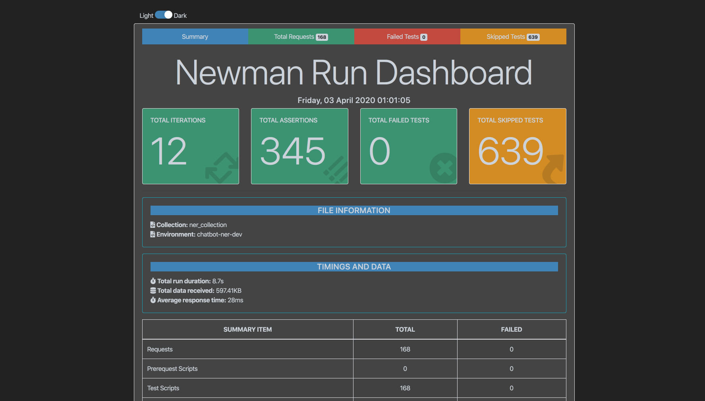

**Running the tests**

***Note:*** Before running the below command, if you are running this for the first time in dev environment, make sure you copy ```config/prod.json``` to ```config/dev.json``` and adjust the host urls in it,
for chatbot-ner and ElasticSearch.

```
docker exec -it docker_chatbot-ner_1 python postman_tests/run_tests.py
```

A shortcut for running the above is available. Just run ```./run_postman_tests.sh``` in the root directory.

**Viewing the test results in dev**

Running the above command in dev will create a ```newman/``` directory in the ```postman_tests/``` folder. The newman command will generate a new timestamped html file everytime the tests are run. This html file contains a graphical dashboard which can be used to see the status of running the tests, failures etc, and yes you can use dark mode as well ;-).



**Adding test data for new entities**

To add test data for a new entity create a new json file in postman_tests/data/entities/.

The format should follow the below structure:

```
[
    "input": {

    },

    "expected": [
        {

        }
    ]
]
```

input contains the parameters that we pass as query parameters in the GET rquest.

expected is an array of objects that we get in the response.

Add tests for the new entity using steps given below in this document and send a PR containing the new collection and data.


**Modifying test data of existing entities**

Modify the enitities data json file in postman_tests/data/entities and if required the tests as well using steps given below in this document and send a PR for the modifications.


**Adding new tests / Modifying existing ones**

Postman tests now use the new Chaijs based BDD syntax and they have deprecated the old one. So all existing tests have been translated to use the new syntax. 

Refer to the [postman documentation](https://learning.postman.com/docs/postman/scripts/test-scripts/) for how to use the new syntax for writing tests.

Use the below steps:

1. First import postman_tests/data/ner_collection.json into postman

2. After adding new tests or modifying existing ones, export the modified collection into ner_collection.json.

3. Run the test suite using the process given in this Readme above to make sure all pass.

4. Send a PR containing the new ner_collection.json and data.


**Adding data to be indexed into ElasticSearch**

Add the csv file for the particular entity in postman_tests/data/elastic_search/ and send a PR.
